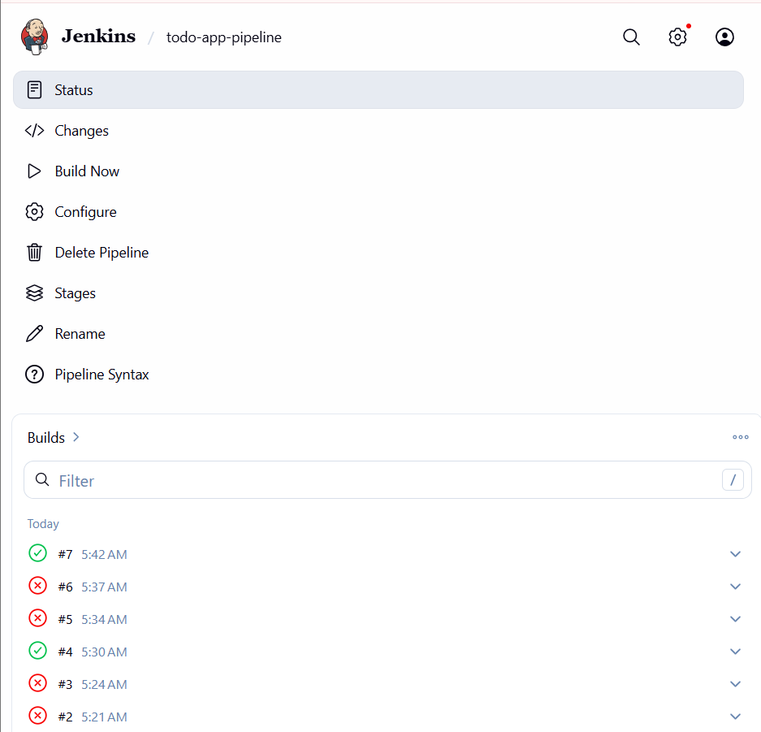
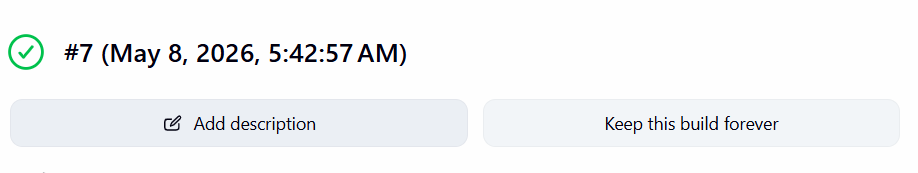
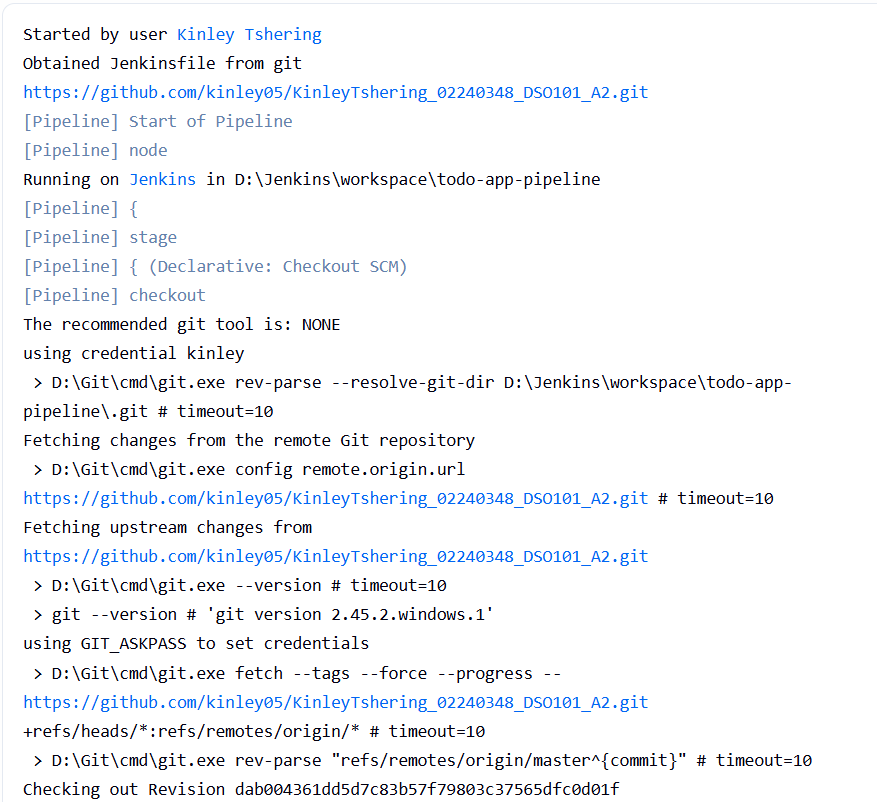
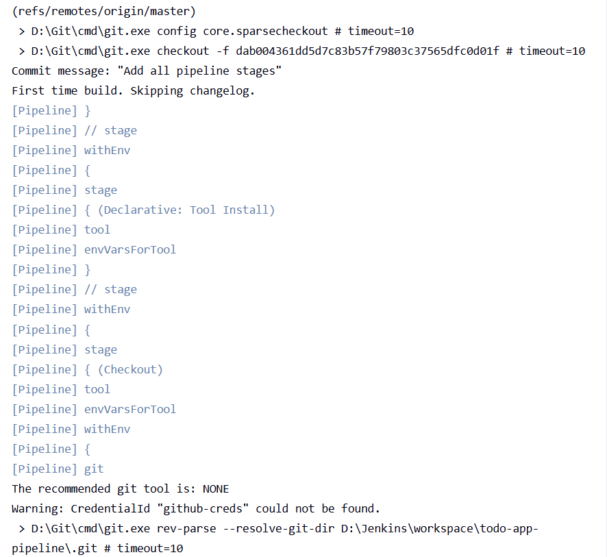
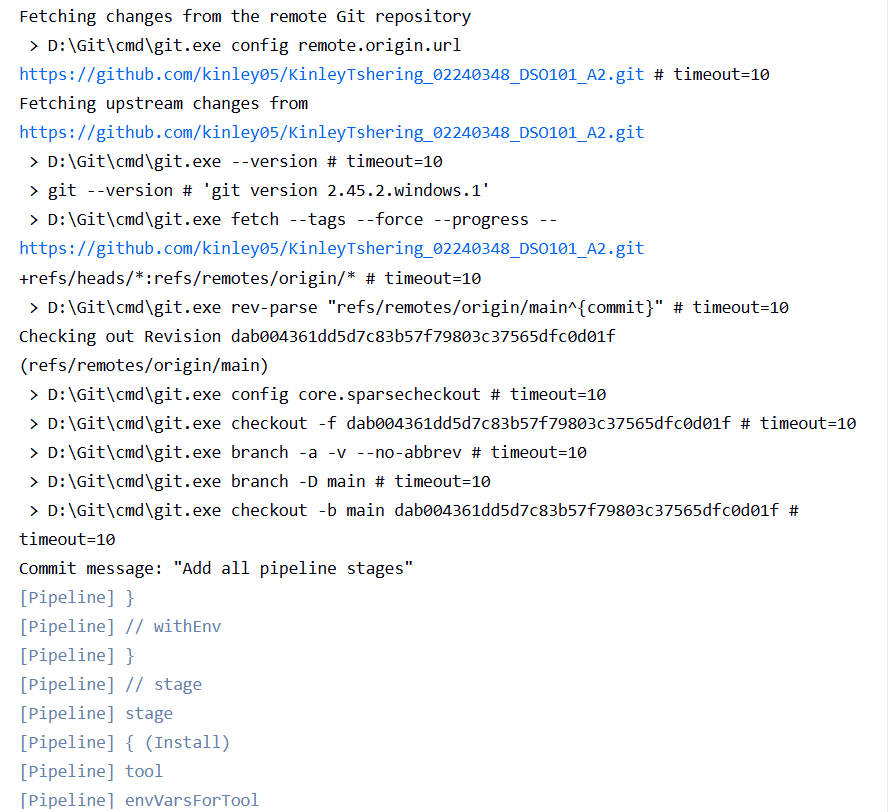
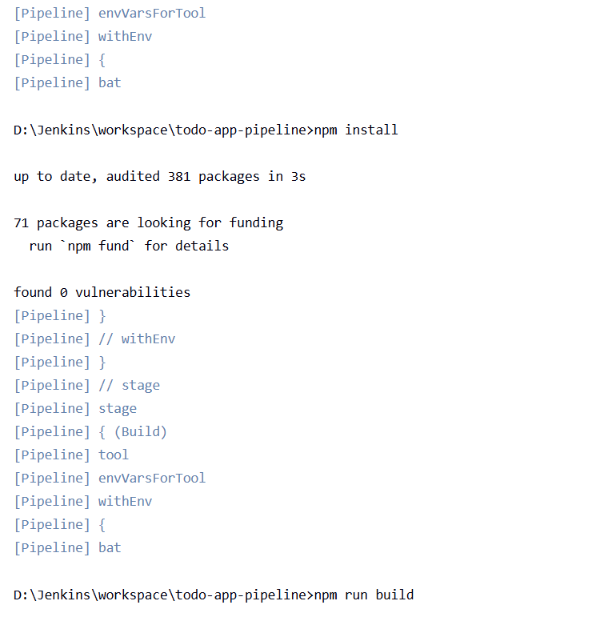
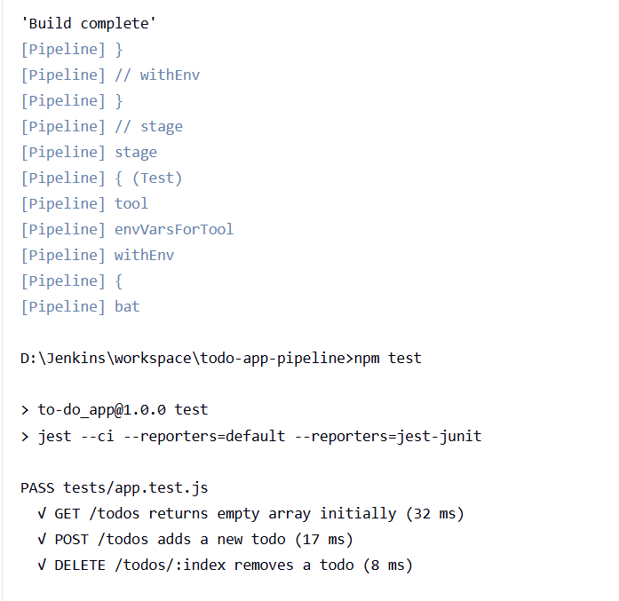
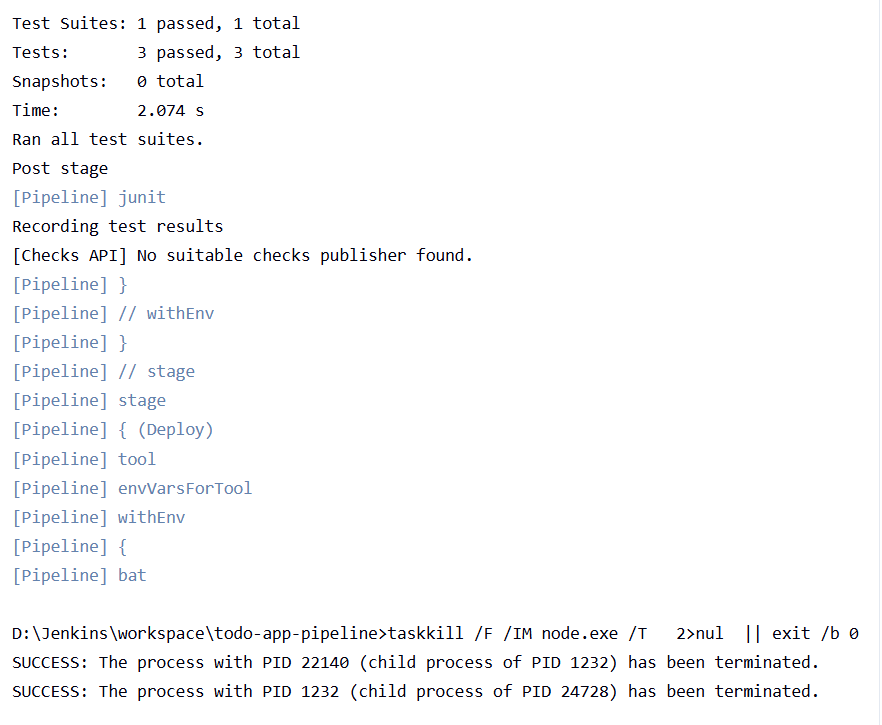
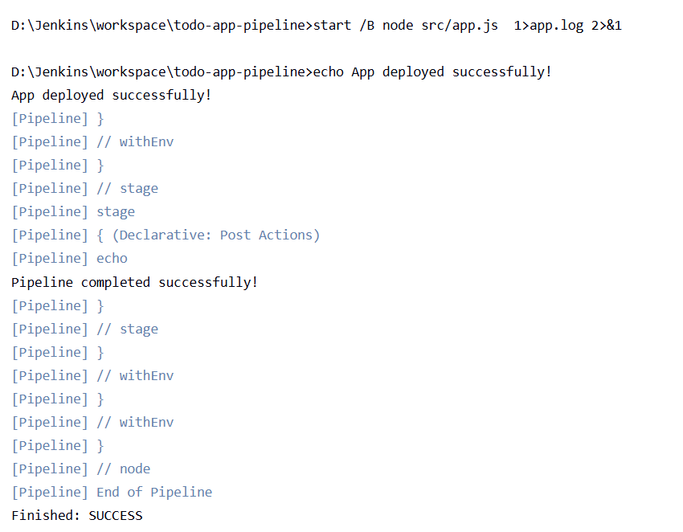

# To-DO app

## GitHub Repository
https://github.com/kinley05/KinleyTshering_02240348_DSO101_A2

## Project Overview
This assignment involved configuring a Jenkins pipeline to automate the 
build, test, and deployment of a Node.js To-Do List application. The 
pipeline automates the entire software delivery process from code checkout 
to deployment.

## Tools and Technologies Used
# Tool
Jenkins- CI/CD automation
Github- Source code hosting
Node.js and npm- JavaScript runtime and package management
Express.js- Web framework for the To-Do API
Jest- Unit testing framework
jest-junit- Generates JUnit XML reports for Jenkins 
supertest- HTTP testing library

## Application Overview
The To-Do application is a RESTful API built with Node.js and Express.js. 
It supports the following operations:

**GET /todos** - Retrieve all todo items
**POST /todos** - Add a new todo item
**DELETE /todos/:index** - Delete a todo item by index

## Pipeline Configuration

The Jenkins pipeline consists of the following stages:

### Stage 1: Checkout
Pulls the latest code from the GitHub repository using Git credentials 
configured in Jenkins.

### Stage 2: Install
Runs `npm install` to install all project dependencies defined in 
`package.json`.

### Stage 3: Build
Runs `npm run build` to build the application. For this Node.js project, 
this stage confirms the build environment is ready.

### Stage 4: Test
Runs `npm test` which executes Jest unit tests. The pipeline includes 
3 unit tests:
- GET /todos returns empty array initially
- POST /todos adds a new todo
- DELETE /todos/:index removes a todo
Test results are published to Jenkins as JUnit XML reports using jest-junit.

### Stage 5: Deploy
Deploys the application directly on the local server by starting the 
Node.js process in the background. Any previously running instance is 
terminated before deploying the new one.

## How to run Locally
1. Clone the repository:
```bash
git clone https://github.com/kinley05/KinleyTshering_02240348_DSO101_A2.git
cd KinleyTshering_02240348_DSO101_A2
```
2. Install dependencies:
```bash
npm install
```
3. Run tests:
```bash
npm test
```
4. Start the application:
```bash
npm start
```
The app runs on **http://localhost:3000**

## Challenges Faced

### 1. Git not detected by Jenkins
Jenkins could not find `git.exe` even though Git was installed on the 
system. This was resolved by manually setting the Git executable path 
to `D:\Git\cmd\git.exe` in Manage Jenkins → Tools → Git installations.

### 2. sh commands not supported on Windows
The Jenkinsfile originally used `sh` commands which are Linux/Mac only. 
Since Jenkins was running on Windows, all `sh` commands were replaced 
with `bat` commands to make the pipeline compatible with Windows.

### 3. Wrong repository URL format
The repository URL was initially set as an SSH URL (`git@github.com:...`) 
which caused host key verification failures. This was fixed by switching 
to the HTTPS URL format (`https://github.com/...`).

### 4. package.json not found
Jenkins could not find `package.json` because the project files were 
inside a subfolder (`To-do_app/`) instead of the repository root. This 
was fixed by re-initializing git from inside the `To-do_app/` folder and 
force pushing to GitHub so all files are at the root level.

### 5. CredentialId not found warning
The credential ID in the Jenkinsfile (`github-creds`) did not match the 
actual credential ID created in Jenkins (`kinley`). The pipeline still 
worked because the repository is public, but the credential ID in the 
Jenkinsfile should match Jenkins for best practice.

## Pipeline Result

### Build History - Successful Pipeline


### Successful Build


### Console Output - Pipeline Start & Checkout










### Console Output - Test Results (3/3 Passed)


### Console Output - Deploy Stage & Pipeline Success
